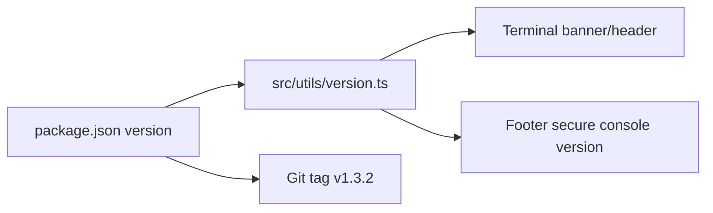

# Architecture

## 1. Architectural status

**Verified:** The production portfolio is a Next.js application using the App Router, TypeScript, React 19, Tailwind CSS v4, Mermaid.js, and Lucide React icons. The package version reviewed on `main` is `1.3.2`.

### Core package snapshot

| Area | Reviewed implementation |
|---|---|
| Framework | Next.js `16.2.10` |
| UI runtime | React / React DOM `19.2.4` |
| Language | TypeScript 5 |
| Styling | Tailwind CSS v4 |
| Diagrams | Mermaid.js `^11.16.0` |
| Icons | Lucide React `^1.24.0` |
| Linting | ESLint 9 + Next.js configuration |
| Package manager | npm / `package-lock.json` |

## 2. Repository architecture

```text
portfolio/
├── .github/
│   └── workflows/
│       └── ci.yml
├── content/
│   ├── certifications.json
│   ├── courses.json
│   ├── education.json
│   ├── experience.json
│   ├── future-sections.json
│   ├── profile.json
│   ├── projects.json
│   ├── skills.json
│   └── social-links.json
├── portfolio-scripts/
│   ├── 01-start-working.ps1
│   ├── 02-save-change.ps1
│   ├── 03-prepare-release.ps1
│   ├── 04-final-testing.ps1
│   ├── 05-publish-production.ps1
│   └── Portfolio-Menu.ps1
├── public/
│   └── resume/
│       └── Osama_Farouk_DevOps_Resume.pdf
├── scripts/
│   ├── add-content.js
│   ├── validate-content.js
│   └── validate-release-tag.js
├── src/
│   ├── app/
│   │   ├── courses/
│   │   ├── projects/[slug]/
│   │   ├── resume/
│   │   ├── globals.css
│   │   ├── layout.tsx
│   │   └── page.tsx
│   ├── components/
│   │   ├── About.tsx
│   │   ├── Certifications.tsx
│   │   ├── Contact.tsx
│   │   ├── Education.tsx
│   │   ├── Experience.tsx
│   │   ├── Hero.tsx
│   │   ├── Layout.tsx
│   │   ├── Mermaid.tsx
│   │   ├── Projects.tsx
│   │   ├── Skills.tsx
│   │   ├── SocialIcons.tsx
│   │   ├── Terminal.tsx
│   │   └── ThemeContext.tsx
│   └── utils/
│       ├── dataLoader.ts
│       ├── scrollHelper.ts
│       ├── terminalCommands.ts
│       ├── terminalEngine.ts
│       └── version.ts
├── tests/
│   └── portfolio.test.mjs
├── next.config.ts
├── package.json
└── package-lock.json
```

> **Verified:** The active route tree is `src/app`. Any older documentation showing `src/pages` is stale.

## 3. Application composition

The root page is a client-side composed portfolio surface wrapped by theme/layout infrastructure. The reviewed section order is:

```text
Hero
→ About
→ Experience
→ Projects
→ Skills
→ Certifications
→ Education
→ Terminal
→ Contact
```

Dedicated routes extend the single-page experience:

- `/courses`
- `/projects/[slug]`
- `/resume`

### Rendering/data flow

```mermaid
flowchart TD
    JSON[(content/*.json)] --> DL[dataLoader.ts]
    DL --> Root[app/page.tsx]
    DL --> ProjectRoute[app/projects/[slug]]
    DL --> CoursesRoute[app/courses]
    DL --> ResumeRoute[app/resume]
    Root --> Sections[Section Components]
    Sections --> Layout[Layout / Navigation / Footer]
    Sections --> Terminal[Terminal.tsx]
    Terminal --> Engine[terminalEngine.ts]
    ProjectRoute --> Mermaid[Mermaid Component]
```

The architecture deliberately isolates professional content from most presentation logic. `dataLoader.ts` imports JSON datasets, provides TypeScript interfaces/selectors, filters draft projects, exposes resume-specific selectors, and calculates summary statistics.

## 4. Content-driven runtime

**Verified:** Published projects are derived from the full project dataset by filtering `draft` records. This permits unpublished work to remain represented in the content store without appearing in production listings.

**Verified:** Resume selectors independently respect a `visibility.resume !== false` flag where supplied. Consequently, the dynamic web resume can differ intentionally from the public landing page while still consuming the same central content store.

**Verified:** Top-level statistics are calculated from datasets. The reviewed logic derives years of experience from `currentYear - 2021`, project count from published projects, certification count from certifications, organization count from unique employers, and skill count from category contents.

## 5. Versioning architecture

`package.json` is the authoritative application version. `src/utils/version.ts` exports that package version and the UI uses it in the terminal banner/header and footer. The automated tests explicitly check that old hard-coded version strings do not reappear.

Current reviewed value: **`1.3.2`**.



## 6. Technical-diagram architecture

Project detail routes use a Mermaid-capable component to display architecture topology. This is appropriate for a technical portfolio because diagrams remain versionable text rather than opaque screenshots.

Maintenance requirements:

- keep diagram node names aligned with project narrative;
- update both topology and written responsibilities/outcomes when architecture changes;
- validate overflow on narrow screens;
- never expose confidential internal hostnames, IP addresses, credentials, bank identifiers not approved for disclosure, or proprietary topology details.

## 7. Security headers

**Verified:** `next.config.ts` defines security-oriented response headers and disables `X-Powered-By`.

| Control | Reviewed state |
|---|---|
| Content-Security-Policy | Configured |
| `X-Frame-Options` | `DENY` |
| `X-Content-Type-Options` | `nosniff` |
| `Referrer-Policy` | `strict-origin-when-cross-origin` |
| HSTS | Enabled with long max-age and preload |
| Permissions Policy | Camera, microphone, geolocation and topics restricted |
| `poweredByHeader` | Disabled |
| React strict mode | Enabled |

**Recommended:** Review whether CSP allowances for `'unsafe-inline'` and `'unsafe-eval'` can be reduced without breaking Next.js/Mermaid behavior. Treat this as a hardening objective, not a claim that the current site is insecure.

## 8. CI architecture

GitHub Actions runs the **CI & Security Audit Pipeline** on pushes and pull requests targeting `main` and `develop`. It uses Node.js 20 and performs:

```text
checkout
→ npm ci
→ validate content schemas
→ validate release-tag alignment
→ TypeScript typecheck
→ ESLint
→ automated tests
→ production Next.js build
```

This is complementary to the local release scripts; it does not replace the final-testing record used by the PowerShell release workflow.

## 9. Hosting architecture

**Verified:** Production is served from a Vercel domain.

**Inferred:** The intended production path is a Vercel deployment associated with the GitHub `main` branch because the controlled publish workflow promotes `develop` to `main` and the live site matches the `main` application version. Exact Vercel project settings, branch binding and environment-variable configuration were not available during this audit and should be verified in Vercel before changing deployment settings.
