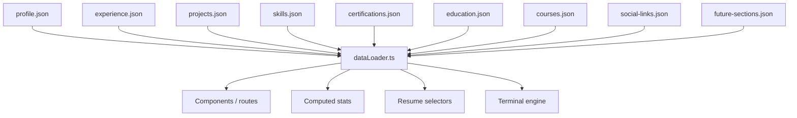
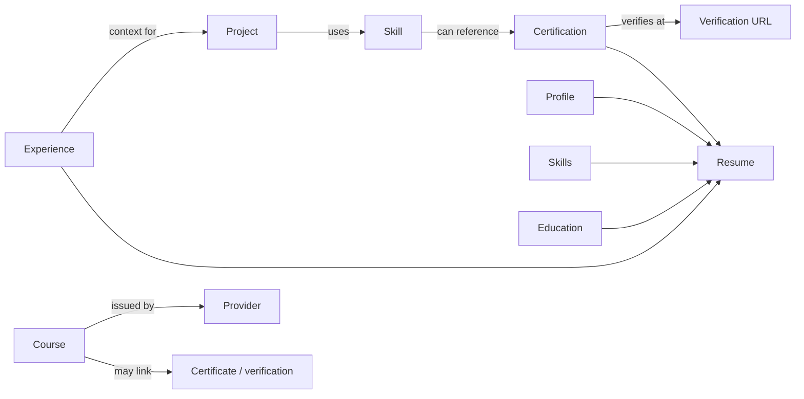

# Content Model

## 1. Design principle

Portfolio content is centralized in JSON under `content/` and accessed through `src/utils/dataLoader.ts`. This is the primary mechanism that keeps the landing page, detail routes, terminal and dynamic resume maintainable.



## 2. Datasets

| File | Responsibility |
|---|---|
| `profile.json` | Identity, role, location, availability, summary, about-story content. |
| `experience.json` | Employment/training timeline, responsibilities, achievements and technologies. |
| `projects.json` | Project cards, project detail narratives, slugs, tags, architecture and visibility state. |
| `skills.json` | Skill categories, proficiency, years and credential associations. |
| `certifications.json` | Credential metadata, verification URLs and badge presentation. |
| `education.json` | Degree, courses/academic items and awards structure. |
| `courses.json` | Full professional-course inventory and certificate/verification metadata. |
| `social-links.json` | External social/contact destinations. |
| `future-sections.json` | Feature-gated/structured future content such as volunteering, languages, blog, testimonials, talks, services and awards. |

## 3. Core interfaces

### Profile

```text
name
title
avatarUrl
roles[]
location
timezone
availability
email
phone
summary
aboutStoryParagraph1
aboutStoryParagraph2
```

### Experience

```text
id
company
project?
role
location
dates
employmentType
summary
responsibilities[]
achievements[]
technologies[]
logo?
current
visibility? (where used)
```

### Project

```text
slug
title
tagline
type
status
date
employer?
role
featured
draft
confidential
environments?
tags[]
background
solution
responsibilities[]
challenges
results[]
githubLink?
liveLink?
architecture?
```

### Skill

```text
name
proficiency
years
certified
certBadge?
certification?
certifications?
```

### Certification

```text
id
name
issuer
code?
issueDate
expiryDate?
credentialId?
verificationLink?
badgeUrl?
imageClass?
containerClass?
```

### Course

```text
id
title
provider
year
certificateImage?
certificateUrl?
verificationUrl?
```

## 4. Relationships



Relationships are conceptual rather than a relational database; references may be represented by duplicated labels/IDs rather than foreign-key enforcement. Therefore naming consistency matters.

## 5. Publication and visibility

**Verified:** `projects` exported for the public UI filters out records with `draft: true`; `allProjects` retains the complete dataset.

**Verified:** Resume selectors can omit records when `visibility.resume === false`.

This allows controlled publication without deleting records.

## 6. Computed statistics

The current data loader computes summary metrics rather than storing every metric manually. Reviewed examples include:

- years of experience → current year minus 2021;
- project total → published project array length;
- certification total → certification array length;
- organization total → unique employer/company set;
- skill total → sum of skill records across categories.

**Recommended:** Extend this principle to every UI/terminal count so course/project/certification totals never drift between screens.

## 7. Data-editing rules

- Prefer stable IDs/slugs; changing a slug breaks inbound links and terminal addressing.
- Do not put confidential values in JSON merely because a project is marked `confidential`; the repository is public.
- Keep dates consistently formatted with existing content.
- Keep proficiency values within the validated vocabulary.
- Verification URLs must point to authoritative credential sources where possible.
- A certificate image path must exist in `public/` or be supported by the current image policy.
- Treat `draft` as publication control, not as a security boundary.
- Keep resume visibility intentional after every experience/project/certification update.

## 8. Content tooling

`package.json` exposes content-oriented scripts:

```bash
npm run add:project
npm run add:experience
npm run add:skill
npm run add:certification
npm run validate:content
```

Use these helper flows when they cover the required change because they reduce malformed JSON/schema drift. Run validation after manual edits regardless.
