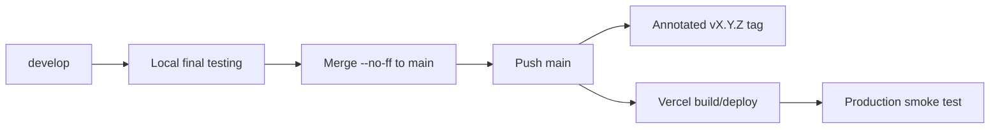

# Deployment and Release

## 1. Production model

**Verified:** Production is served by Vercel and the live application version reviewed is `1.3.2`.

**Verified:** The repository release model promotes tested `develop` code to `main` and creates an annotated matching version tag.

**Inferred:** Vercel production is configured to deploy from `main`. This is consistent with the workflow and observed production version, but provider settings were not directly available during the audit.

## 2. Release lifecycle



## 3. Build gate

The release candidate should pass:

```bash
npm run validate:content
npm run lint
npm run typecheck
npm test
npm run build
```

GitHub Actions repeats the equivalent quality path on branch pushes/PRs.

## 4. Production validation

After publication, manually check:

- footer/terminal display the intended application version;
- root route renders without hydration/runtime errors;
- header routes to each home section;
- all six current project routes resolve (or the current dataset equivalent after changes);
- `/courses` search/filter opens and certificate actions behave;
- `/resume` renders and Download PDF works;
- terminal executes `help`, collection list/show/open behavior and Y/N navigation;
- contact form validation works; use a real submission only when appropriate;
- external credential/social links open safely;
- desktop and mobile-width navigation are usable;
- no client-sensitive information was introduced.

## 5. Rollback

### Application regression
Use a Git revert/patch release through the controlled workflow. Preserve public history.

### Deployment/provider regression
If a previous known-good Vercel deployment can be redeployed, use it as an operational containment step, then immediately align Git source/version with the actual production state.

### Content-only regression
Correct the content record on `develop`, validate, and publish a patch release if production impact warrants it.

## 6. Deployment troubleshooting

| Symptom | First checks |
|---|---|
| Vercel build fails | Compare provider Node/build settings with Node 20 CI; run `npm ci && npm run check:all` locally. |
| Local passes, CI fails | Confirm clean lockfile, runtime version and tag-validation environment. |
| Main updated but live old | Check Vercel production branch/deployment status and whether the latest main commit triggered a build. |
| Version mismatch | Check `package.json`, tag, `version.ts` usage and release-preparation sequence. |
| Project route 404 | Confirm project slug, draft state, route generation/data loading and production build. |
| Asset/certificate image missing | Verify public path, casing and image source policy. |
| Contact failure | Check Formspree service/form status, network response and rate-limit UI. |
