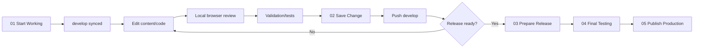

# Development Guide

## 1. Prerequisites

The hosted CI uses **Node.js 20** and npm. Match this major version locally for reproducibility unless the repository later defines a stricter runtime contract.

```bash
git clone <repository>
cd portfolio
npm ci
npm run dev
```

The default Next.js development server is then used for local review.

## 2. Package scripts

| Command | Purpose |
|---|---|
| `npm run dev` | Start Next.js development server. |
| `npm run build` | Production Next.js build. |
| `npm run start` | Run built production server. |
| `npm run lint` | ESLint. |
| `npm run typecheck` | `tsc --noEmit`. |
| `npm test` | Node-based automated portfolio tests. |
| `npm run add:project` | Guided project-content addition. |
| `npm run add:experience` | Guided experience-content addition. |
| `npm run add:skill` | Guided skill-content addition. |
| `npm run add:certification` | Guided certification-content addition. |
| `npm run validate:content` | Validate portfolio content schema/constraints. |
| `npm run validate:tag` | Validate release tag alignment. |
| `npm run check:all` | Content + tag validation, typecheck, lint, tests and build. |

## 3. Development architecture

Most routine portfolio changes belong in one of three layers:

```text
Content change
→ content/*.json

Presentation/interaction change
→ src/components/* or src/app/*

Cross-cutting behavior
→ src/utils/*, next.config.ts, tests, scripts
```

Do not edit a component simply to change a job title, skill, project or course if a corresponding content record exists.

## 4. Standard development cycle



The PowerShell scripts are documented in `GIT_WORKFLOW.md`.

## 5. CI pipeline

GitHub Actions workflow name: **CI & Security Audit Pipeline**.

Triggers:

- push to `main` or `develop`;
- pull request targeting `main` or `develop`.

Job sequence:

```text
Checkout
→ setup Node 20 + npm cache
→ npm ci
→ node scripts/validate-content.js
→ node scripts/validate-release-tag.js
→ npx tsc --noEmit
→ npm run lint
→ npm test
→ npm run build
```

A local build passing does not justify bypassing a failing CI job; investigate the mismatch.

## 6. Automated tests reviewed

`tests/portfolio.test.mjs` currently checks at least:

1. static resume PDF exists and is >1KB;
2. external `_blank` links include `noopener noreferrer`;
3. key security headers are configured;
4. project records include required route/title integrity and a minimum project threshold;
5. content files are scanned for obvious committed AWS key/private-key patterns;
6. version source is authoritative and UI does not hard-code old `2.4.0` values;
7. release-tag validation succeeds for the current version and fails for a mismatch.

**Important limitation:** the PDF test validates presence/size, **not resume-content freshness**. Manual synchronization validation is therefore still required.

## 7. Content additions

For a normal content change:

1. update/add the canonical JSON record;
2. run `npm run validate:content`;
3. run `npm run dev` and inspect the affected UI;
4. exercise search/filter/terminal/resume relationships affected by the record;
5. run full final tests before release;
6. update relevant documentation.

## 8. Mermaid development

When changing a diagram:

- validate Mermaid syntax;
- inspect desktop and narrow viewport rendering;
- ensure label text remains readable;
- keep the written problem/solution in sync;
- sanitize client diagrams;
- avoid giant diagrams that require unusable horizontal scrolling.
