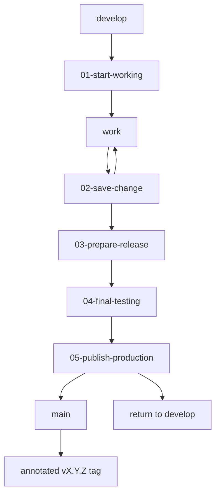

# Git and Release Workflow

## 1. Branch model

| Branch | Role |
|---|---|
| `develop` | Primary working/integration branch. |
| `main` | Production/release branch. |

Current repository metadata also shows automated dependency branches, but they are not the normal manual portfolio workflow.

## 2. Release philosophy

The portfolio uses explicit operator scripts to reduce accidental branch mistakes. The scripts do not force-push or overwrite tags, and publication requires a matching successful final-test record.



## 3. `01-start-working.ps1`

### Purpose
Establish a clean/safe `develop` starting point before editing.

### Reviewed behavior

- expected local repository: `D:\Portfolio` in the current operator workflow;
- detects unfinished Git operations or misplaced working state;
- switches to `develop`;
- synchronizes with `origin/develop` using fast-forward-only pull;
- refuses unsafe continuation rather than hiding unresolved state.

### Expected use
Run at the start of a work session or before resuming changes after branch/release activity.

## 4. `02-save-change.ps1`

### Purpose
Create a controlled conventional commit and push normal changes to `develop`.

### Preconditions

- current branch must be `develop`;
- review the working tree before committing.

### Reviewed commit types

`feat`, `fix`, `content`, `docs`, `security`, `refactor`, `style`, `perf`, `test`, `chore`.

### Behavior
Stages reviewed changes, creates the typed commit and pushes `origin/develop`.

## 5. `03-prepare-release.ps1`

### Purpose
Prepare a new semantic application version on `develop`.

### Preconditions

- clean, synchronized `develop`;
- new version must be greater than current version;
- operator supplies `X.Y.Z`.

### Behavior
Updates npm version files without automatically tagging, commits a message in the form:

```text
release: prepare portfolio vX.Y.Z
```

and pushes `develop`.

## 6. `04-final-testing.ps1`

### Purpose
Run the release gate against the exact release candidate.

### Reviewed check order

```text
validate:content
→ lint
→ typecheck
→ test
→ build
```

If successful, the workflow records the tested commit/version in `portfolio-tools\final-test.json` for the publish stage.

Do not edit source after a passing final test and then reuse the old record.

## 7. `05-publish-production.ps1`

### Purpose
Promote the tested release candidate to production history.

### Preconditions

- final-test record matches the exact `develop` commit/version;
- operator confirms the intended release/version;
- branch state is safe for merge.

### Reviewed behavior

1. verify tested version/commit;
2. merge `develop` into `main` using `--no-ff`;
3. push `main`;
4. create/push annotated `vX.Y.Z` tag;
5. return the local working branch to `develop`.

Merge failures are not silently auto-resolved.

## 8. Conflict safety

The workflow deliberately avoids broad automatic conflict resolution. One narrow exception exists for `package.json` / `package-lock.json` conflict handling using tested `develop` copies only after operator confirmation. Backup/stash protection is retained rather than discarded automatically.

Unfinished merge/rebase/cherry-pick/revert/bisect states are treated as blockers.

## 9. Portfolio menu

`Portfolio-Menu.ps1` acts as a launcher for the staged workflow so the release sequence remains discoverable and consistent.

## 10. Emergency rollback

Prefer a new corrective commit/release over rewriting shared history.

Safe options:

1. revert the offending commit on `develop`, test and publish a patch release;
2. for urgent production rollback, revert the merge/release change on `main` using standard Git history, then reconcile `develop` immediately;
3. if Vercel supports provider-level redeploy of a known-good deployment, that can restore service quickly, but Git branches must still be reconciled so source-of-truth and production do not diverge.

Never force-push `main` as a normal rollback mechanism.

## 11. Script outcome and failure reference

| Script | Successful end state | Failure handling |
|---|---|---|
| `01-start-working.ps1` | On synchronized `develop`, ready to edit | Stops on unfinished Git state, unsafe branch/worktree condition or non-fast-forward synchronization issue; resolve explicitly before retrying. |
| `02-save-change.ps1` | Conventional commit exists on `develop` and is pushed to `origin/develop` | A staging/commit/push failure is surfaced; do not switch to `main` or bypass by force pushing. |
| `03-prepare-release.ps1` | `develop` contains/pushes the new package version commit | Rejects invalid/non-increasing version or unsafe/sync state; correct state/version and rerun. |
| `04-final-testing.ps1` | Exact commit/version has a successful final-test record | Stops on the first failed validation/check; fix, commit if needed, and rerun so the record matches the final candidate. |
| `05-publish-production.ps1` | Tested `develop` merged to `main`, `main` pushed, annotated tag pushed, operator returned to `develop` | Refuses mismatched test record/version; merge failures remain manual; no force push or tag overwrite. |
