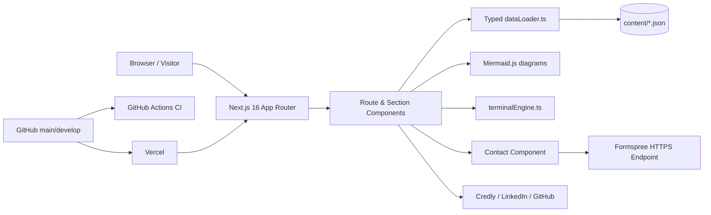

# Osama Farouk Portfolio — Technical Documentation

> Canonical engineering documentation for the production DevOps / Cloud portfolio.

## Documentation metadata

| Field | Value |
|---|---|
| Documentation version | **1.0.0** |
| Portfolio version | **1.3.2** |
| Last live-site review | **2026-08-12** |
| Last documentation update | **2026-08-12** |
| Production URL | `https://portfolio-snowy-mu-65.vercel.app/` |
| Repository | `https://github.com/OsamaFarouk/portfolio` |
| Production branch | `main` |
| Development branch | `develop` |
| Hosting | Vercel production deployment |
| Documentation status | **Synchronized with the production site and public `main` source as reviewed on 2026-08-12** |

## Accuracy labels

This documentation uses four explicit evidence labels:

- **Verified** — confirmed from the production site, current public source, current repository metadata, or supplied screenshots.
- **Historical** — confirmed from the implementation history but no longer the production behavior.
- **Inferred** — strongly indicated by the available evidence, but not directly verified in the provider/runtime configuration.
- **Recommended** — a proposed improvement; not a claim about current behavior.

## Source precedence

When sources disagree, use this order:

1. Production portfolio behavior and content.
2. Current `main` branch source and versioned repository state.
3. Latest accepted implementation details from the Portfolio Web Prompt development history.
4. Screenshots supplied for the final audit.
5. Older resume/CV and older implementation notes.

The downloadable PDF resume is intentionally treated as a separate static artifact and **must not override** newer production content.

## Executive overview

The portfolio is a console-inspired professional website that presents Osama Farouk's DevOps and cloud-infrastructure experience as an operational system rather than a conventional static résumé page. Its information architecture combines a single-page overview with dedicated project, course, and dynamic resume routes. The visual language uses terminal/operations concepts such as nodes, inventory, control plane, status badges, deployment lifecycle, and an interactive terminal.

The production implementation is a **Next.js App Router** application written in **TypeScript**, styled with **Tailwind CSS v4**, and uses **Mermaid.js** for technical diagrams. Portfolio content is centralized in JSON files under `content/` and loaded through a typed data layer, which is the principal maintainability mechanism: most professional-content changes should be data changes rather than component rewrites.

## Current production snapshot

At documentation revision 1.0.0, production presents:

| Inventory | Reviewed state |
|---|---:|
| Professional-experience timeline entries | 7 |
| Published projects/labs | 6 |
| Skill records | 25 |
| Verified certification cards | 5 |
| Professional courses | 23 |
| Application version | 1.3.2 |

These values are a **snapshot**, not permanent architectural constraints. Do not hard-code them into future documentation unless the UI or test contract intentionally requires a threshold.

## Canonical documentation set

| File | Purpose |
|---|---|
| [`ARCHITECTURE.md`](ARCHITECTURE.md) | Application architecture, technology stack, security headers, rendering/data flow, versioning. |
| [`SITE_STRUCTURE.md`](SITE_STRUCTURE.md) | Routes, home sections, navigation, header, footer, responsive navigation behavior. |
| [`FEATURES.md`](FEATURES.md) | Functional specification of portfolio sections, resume, credentials, contact and UI/UX system. |
| [`TERMINAL.md`](TERMINAL.md) | Interactive control-console architecture, command registry, context model, keyboard behavior and confirmations. |
| [`PROJECTS.md`](PROJECTS.md) | Published project inventory and project-detail architecture narratives. |
| [`CONTENT_MODEL.md`](CONTENT_MODEL.md) | `content/` JSON model, typed selectors, relationships, stats and content maintenance. |
| [`INTEGRATIONS.md`](INTEGRATIONS.md) | Vercel, GitHub, Formspree, Credly, LinkedIn and other external integration boundaries. |
| [`DEVELOPMENT.md`](DEVELOPMENT.md) | Local setup, npm commands, CI, content tooling and development workflow. |
| [`GIT_WORKFLOW.md`](GIT_WORKFLOW.md) | `develop` → `main` release model and PowerShell helper scripts. |
| [`DEPLOYMENT.md`](DEPLOYMENT.md) | Release, build, Vercel deployment, production validation and rollback. |
| [`MAINTENANCE.md`](MAINTENANCE.md) | How to add/update portfolio content and documentation update matrix. |
| [`TESTING.md`](TESTING.md) | Automated checks plus production regression checklist. |
| [`SECURITY_ACCESSIBILITY_PERFORMANCE.md`](SECURITY_ACCESSIBILITY_PERFORMANCE.md) | Current controls, visible accessibility, performance considerations and recommendations. |
| [`TROUBLESHOOTING.md`](TROUBLESHOOTING.md) | Operational troubleshooting and current technical/content debt. |
| [`DECISIONS.md`](DECISIONS.md) | Concise engineering decision record for important final choices. |
| [`SOURCE_AUDIT.md`](SOURCE_AUDIT.md) | Audit scope, screenshot inventory and evidence/freshness notes. |
| [`CHANGELOG.md`](CHANGELOG.md) | Documentation change history. |

## High-level architecture

## Maintenance principle

**Edit the canonical data first, then the presentation only when behavior/layout must change.** After every portfolio change, run the repository validation/build pipeline, update the affected documentation modules, bump the documentation version according to the rules in `MAINTENANCE.md`, and append a changelog entry.

## Current attention items

The audit found several items worth addressing; details and severity are in `TROUBLESHOOTING.md`:

1. The downloadable PDF résumé is older than the dynamic `/resume` data and does not include the current ZainTech position.
2. The Kubernetes Observability project detail contains conditional/placeholder phrasing such as “if tested,” which should be finalized for production wording.
3. The repository README's illustrated source tree references the older `src/pages` convention, while the current implementation uses `src/app`.
4. The terminal engine contains course-count wording tied to the current total (`23`) rather than deriving every displayed count from data, creating future documentation/UI drift risk.

## Update protocol

When the portfolio changes, do **not** regenerate everything by default. Determine the changed content/component, update the relevant documentation file(s), increment `Documentation Version`, set a new `Last Live-Site Review` only if production was actually reviewed, append `CHANGELOG.md`, and state exactly what changed. The detailed matrix is in `MAINTENANCE.md`.
