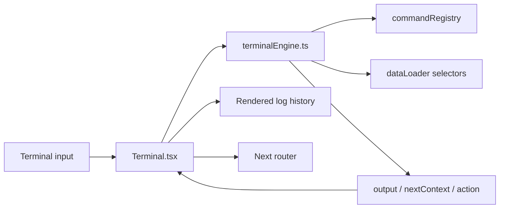

# Interactive System Terminal

## 1. Purpose

The terminal is not a decorative fake input. It is a client-side portfolio query/navigation interface backed by `src/utils/terminalEngine.ts` and rendered by `src/components/Terminal.tsx`. It exposes portfolio datasets through command semantics while preserving the site's control-plane visual identity.

Current console identity:

```text
OSAMA INFRASTRUCTURE CONTROL CONSOLE [v1.3.2-STABLE]
```

The initial banner opens a secure/read-only portfolio session, loads the portfolio cluster context, reports service status and instructs the visitor to use `help`.

## 2. Component architecture



`Terminal.tsx` owns presentation/state; `terminalEngine.ts` owns parsing, registry semantics, contextual commands, output and navigation intents.

## 3. State model

The component maintains:

- current `TerminalContext`;
- rendered log history;
- raw command history;
- command-history cursor;
- current input;
- optional pending navigation confirmation;
- auto-scroll/output refs.

The context changes after collection commands such as `experience`, `projects`, `certifications` and `courses`, allowing subsequent numeric or record-oriented actions to resolve against the correct dataset.

## 4. Primary command registry

The current rich engine exposes the following top-level portfolio commands. Aliases are summarized from the reviewed registry.

| Command | Important aliases | Core usage | Result / navigation |
|---|---|---|---|
| `overview` | `home`, `main` | `overview [open]` | Displays overview summary; can navigate to `/#home`. |
| `whoami` | `operator`, `profile` | `whoami` | Displays operator/profile information. |
| `status` | `health`, `sys` | `status` | Displays control-plane/portfolio status. |
| `experience` | `work`, `jobs`, `career` | `experience [list \| search <query> \| show <id|num> \| open <id|num>]` | Lists/searches/shows experience and can navigate to `/#experience`. |
| `certifications` | `certs`, `credentials` | `certifications [list \| search <query> \| show <id|num> \| open <id|num>]` | Queries certification records and can open credentials area/verification flow as defined. |
| `courses` | `training`, `professional-courses` | `courses [list \| search <query> \| show <id|num> \| open <id|num>]` | Queries courses and can route to `/courses`. |
| `projects` | `labs`, `inventory` | `projects [list \| search <query> \| show <slug|num> \| open <slug|num>]` | Queries projects; detail open requires navigation action. |
| `skills` | `tech`, `stack` | `skills [list \| search <query> \| open]` | Lists/searches skill inventory; can navigate to `/#skills`. |
| `education` | `degree`, `academic`, `awards` | `education [list \| open]` | Displays education/award information and can navigate to `/#education`. |
| `contact` | `email`, `socials` | `contact [open]` | Displays contact endpoints and can navigate to `/#contact`. |
| `resume` | `cv` | `resume` | Displays resume target and prompts for Y/N before opening `/resume`. |
| `help` | `man`, `commands` | `help [<command>]` | Dynamic command manual generated from the registry. |

The engine also supports terminal control behavior such as clearing output; use `help` on production as the authoritative human-facing command list after future changes.

## 5. Record addressing

### Numeric selection
Collection commands can resolve records by displayed number. Numeric input is scoped through terminal context so a number following a project listing is interpreted against projects rather than another previously listed collection.

### Text/ID selection
Depending on collection, the engine can resolve:

- stable ID;
- slug;
- certification code/name;
- company/name-like query;
- search terms across project title/tagline/tags/slug.

This gives both discoverable numbered navigation and direct expert use.

## 6. Navigation confirmation

When a command produces a navigation request that requires confirmation, `Terminal.tsx` sets a pending-confirmation payload containing prompt text, route, title and optional next context.

Accepted confirmation input:

- `Y`
- `y`
- `yes`
- empty Enter while confirmation is pending

Cancellation input:

- `N`
- `n`
- `no`
- `cancel`
- `Escape`

Unrelated text during a pending confirmation does not execute a new command; the user is prompted to answer Y or N. This deliberately prevents accidental navigation and fixes the class of state confusion that can occur when a selection is displayed before route transition.

## 7. Keyboard behavior

**Verified:** Terminal keyboard support includes:

| Key | Behavior |
|---|---|
| `ArrowUp` | Previous command from command history |
| `ArrowDown` | Next command / return to blank input |
| `Tab` | Autocomplete; fills a unique suggestion or prints multiple suggestions |
| `Ctrl+L` | Clears rendered terminal output |
| `Escape` | Cancels a pending navigation confirmation |
| `Enter` | Executes current input; during confirmation an empty Enter means Yes |

The header also exposes a clear/reset-output icon. Clearing rendered output does not imply deletion of portfolio data.

## 8. Output behavior

The output renderer recognizes semantic status lines such as `[OK]` and highlights operational keywords. Log entries preserve prompt path, input, output and timestamp. The output container auto-scrolls when history changes.

Responsive prompt helpers provide a shorter mobile representation when horizontal space is limited.

## 9. Historical vs current behavior

**Historical:** Earlier development iterations explored more Linux-like commands such as `ls` and filesystem-style navigation. The current production terminal is a **portfolio command registry**, not a simulated Linux filesystem. Do not document `ls`, `pwd`, directory trees or arbitrary shell execution as current functionality unless they are reintroduced and verified.

**Verified:** `Terminal.tsx` imports `terminalEngine.ts`. A simpler `terminalCommands.ts` file still exists in the source tree; because the production component is wired to the richer engine, treat the simpler implementation as legacy code unless another import is intentionally introduced.

## 10. Known maintainability risk

The current engine includes wording tied to the present course total (`23`) in some command output/help content. The `/courses` UI itself is data-driven. A future course addition can therefore make terminal copy stale even though the course page updates correctly.

**Recommended fix:** derive all count-bearing terminal strings from `courses.length` or a shared stats selector.

## 11. Adding a terminal command

1. Define the command/aliases/usage/description in `commandRegistry`.
2. Implement parsing and output using existing data selectors rather than importing raw JSON into the component.
3. Define `nextContext` only if subsequent record addressing needs a collection context.
4. Use a pending-confirmation action for route changes where accidental navigation would disrupt the terminal flow.
5. Add autocomplete coverage.
6. Update terminal tests if introduced/available.
7. Manually test command, aliases, invalid arguments, numeric/text addressing, Y/N cancellation, mobile prompt and `help <command>`.
8. Update this command table and `CHANGELOG.md`.
